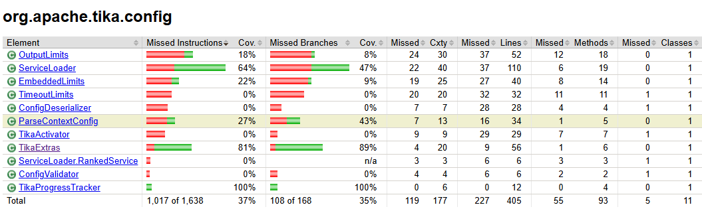
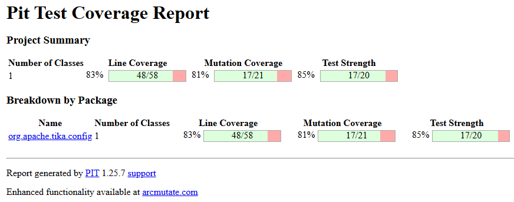
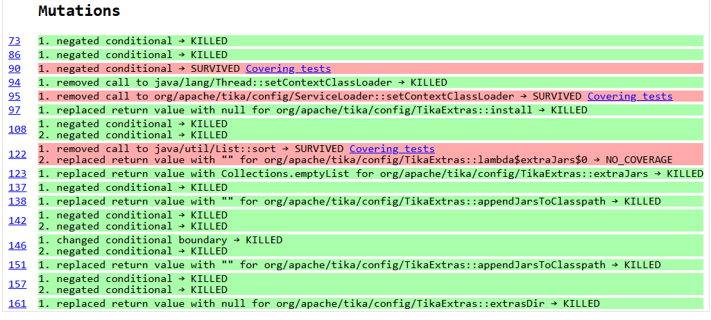
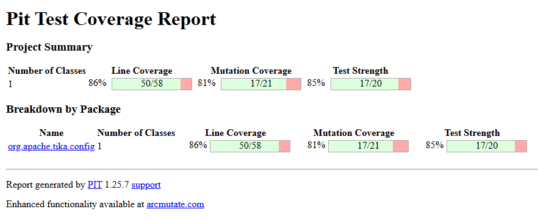

## 1. Choix de la classe

| Élément | Valeur |
|---|---|
| Classe | `org.apache.tika.config.TikaExtras` |
| Test existant | `TikaExtrasTest` (5 tests, tous réussis) |
| Couverture JaCoCo des instructions | 81 % |
| Couverture JaCoCo des branches | 89 % (À COMPLÉTER : vérifier le nombre de branches manquées) |
| Lignes non couvertes (rouge) | 82, 83, 87, 91, 116, 117, 162, 163, 164 |
| Lignes partiellement couvertes (jaune) | 86, 90, 122, 157 |

<!--  -->
<!--  -->
<!--  -->

**Justification** Classe courte, sans dépendance lourde, logique claire (conditions, tri, construction
d'un classpath), avec un test existant mais incomplet.

**Preuve de mutants vivants (mesure A).** Pitest, avec uniquement `TikaExtrasTest` :

| Mutants générés | Tués | Score de mutation | Sans couverture | Force des tests |
|---|---|---|---|---|
| 21 | 17 | 81 % | 1 | 85 % |

Couverture de ligne (classes mutées) : 48/58 (83 %). Rapport archivé : `docs/pit-A/`.

<!--  -->
<!--  -->

Mutants vivants (4) :

| Ligne | Mutant | Statut | Pourquoi les tests d'origine ne le détectent pas |
|---|---|---|---|
| 90 | negated conditional (`if (parent == null)`) | SURVIVED | le test fournit un classloader déjà non nul, et le classloader de remplacement est le même objet dans l'environnement de test |
| 95 | removed call to `ServiceLoader::setContextClassLoader` | SURVIVED | le test vérifie le classloader du thread, pas celui de `ServiceLoader` |
| 122 | removed call to `List::sort` | SURVIVED | tous les tests utilisent un seul jar, le tri n'a aucun effet visible |
| 122 | replaced return value with `""` pour `lambda$extraJars$0` | NO_COVERAGE | le comparateur n'est appelé qu'avec au moins deux jars |

Remarque : les lignes rouges 82-83, 116-117 et 162-164 (blocs `catch`) comptent pour la couverture JaCoCo mais
ne produisent aucun mutant vivant : Pitest ignore par défaut les appels aux bibliothèques de log.

## 2. Génération des tests

### 2.1 Exécution sans intervention manuelle

Les deux classes de test (sans la Suite) ont été copiées telles quelles dans
`tika-core/src/test/java/org/apache/tika/config/`.

- **Avec checkstyle activé**, le build s'arrête à la phase `validate` : 31 violations lors de la première
  exécution. Lors d'une seconde exécution, sans modification de notre part, il n'en restait que 8, toutes de la
  même règle (imports avec `.*` interdits, 4 par fichier). Hypothèse : Spotless, exécuté par le build de Tika,
  a corrigé automatiquement l'en-tête, l'ordre et les imports inutilisés (À CONFIRMER : `docs/spotless-diff.txt`).
  Les tests ne passent donc pas sans intervention.
- **Avec checkstyle désactivé** (`-Dcheckstyle.skip=true`), les deux fichiers compilent et 5 tests s'exécutent :

| Fichier | Tests | Réussis | Erreurs |
|---|---|---|---|
| `TikaExtras_extrasDir_3_1_Test` | 1 | 1 | 0 |
| `TikaExtras_appendJarsToClasspath_2_1_Test` | 4 | 0 | 4 |

Les 4 erreurs sont des `NullPointerException` identiques : `Files.isDirectory` est appelée dans la préparation
du test (`when(Files.isDirectory(mockDir))`) sur un `Path` simulé dont `getFileSystem()` renvoie `null`. Les tests
plantent avant d'appeler `TikaExtras`. Rapports : `docs/surefire-brut/`.

Écart observé : le log de ChatUniTest annonçait un succès au tour 4 pour `appendJarsToClasspath`, alors que ses
4 tests plantent dans notre projet.

### 2.2 Explication et critique des tests générés

**`TikaExtras_extrasDir_3_1_Test`** (1 test, `testExtrasDir_WhenPropertyIsBlank`). Il définit `tika.extras.dir`
à `"   "` et vérifie avec `assertNull` que `extrasDir()` renvoie `null`.
- Points positifs : il cible un cas que `TikaExtrasTest` ne vérifie pas (propriété définie mais blanche, ligne 157) ;
  l'oracle est précis (sans la condition `isBlank()`, `Path.of("")` renverrait un chemin vide et non `null`) ;
  nom explicite, structure Arrange / Act / Assert lisible.
- Défauts : la propriété système n'est jamais restaurée (fuite d'état global) ; réflexion inutile pour construire
  un objet à constructeur privé alors que la méthode est statique ; `@ExtendWith(MockitoExtension.class)` sans aucun
  mock ; imports `*` ; un seul cas, le chemin invalide (lignes 162-164) n'est pas testé.

**`TikaExtras_appendJarsToClasspath_2_1_Test`** (4 tests, tous en erreur). L'intention (aucun jar, jars présents,
erreur de résolution) est raisonnable, mais les tests vérifient des mocks, pas le code :
- simulation de méthodes statiques du JDK (`Files.isDirectory`, `Files.newDirectoryStream`) sans `mockStatic` ;
- mock de la classe testée, qui n'a que des méthodes statiques (l'instance passée à `invoke` est ignorée) ;
- le code testé lit une propriété système (une chaîne) : y placer `mockDir.toString()` ne peut jamais exposer
  les jars simulés ;
- oracles inventés (`"existing/jar1.jar"`, avec des `/` codés en dur, faux sous Windows) pour des jars inexistants ;
- `doThrow(new Exception(...))` sur `toAbsolutePath()`, qui ne déclare pas d'exception vérifiée ;
- deux tests redondants avec `appendJarsToClasspathOffReturnsInput` de `TikaExtrasTest` ;
- propriété système jamais restaurée.

### 2.6 Comparaison des oracles

| Critère | Tests originaux (`TikaExtrasTest`) | Tests générés |
|---|---|---|
| Valeurs vérifiées | chaînes exactes (`"base" + sep + abs`), `assertSame` sur l'objet | une valeur (`assertNull`), ou chaînes inventées |
| Données de test | vrais jars créés dans un `@TempDir` | mocks de `Path`, de `Files`, de la classe testée |
| Portabilité | `File.pathSeparator`, fermeture du `URLClassLoader` pour Windows | `/` codé en dur |
| Nettoyage de l'état global | `finally` qui restaure propriété et classloader | aucun |
| Ce qui est testé | le code réel de `TikaExtras` | surtout les mocks eux-mêmes |
| Apport | — | seul cas nouveau : propriété blanche (ligne 157) |

## 3. Mutation

Commande : `mvn test-compile org.pitest:pitest-maven:mutationCoverage`. Rapports archivés dans `docs/pit-A/`,
`docs/pit-B/` et `docs/pit-C/`.

| Mesure | Tests utilisés | Mutants générés | Tués | Score | Force des tests | Couverture de lignes |
|---|---|---|---|---|---|---|
| A | `TikaExtrasTest` | 21 | 17 | 81 % | 85 % | 48/58 (83 %) |
| B | + `TikaExtras_extrasDir_3_1_Test` (tel que généré) | 21 | 17 | 81 % | 85 % | 50/58 (86 %) |
| C | + tests manuels | À COMPLÉTER | | | | |

### Mesure B : tests d'origine + test généré

Pitest avec `TikaExtrasTest` et le test généré `TikaExtras_extrasDir_3_1_Test`, sans retouche (checkstyle désactivé,
pour mesurer ce que l'IA a réellement produit).

Le score de mutation est inchangé : **les tests générés ne détectent pas tous les mutants, et n'en détectent
aucun de plus que les tests d'origine**. Les 4 mutants vivants (lignes 90, 95 et 122) survivent.

**Pourquoi.** Le seul test généré utilisable n'appelle que `extrasDir()` avec une propriété blanche. Les mutants
vivants sont dans `install()` (classloader parent, enregistrement auprès de `ServiceLoader`) et dans `extraJars()`
(tri des jars), des méthodes que ce test n'exécute jamais. La couverture de lignes a pourtant augmenté de 2 lignes
sans détecter de bug supplémentaire : la couverture ne mesure pas la capacité à détecter des défauts.

À COMPLÉTER : lignes gagnées (hypothèse : le constructeur privé, appelé par réflexion) et test qui tue les mutants
de la ligne 157.

<!--  -->

### Mesure C

À COMPLÉTER après les tests manuels : chiffres, mutants restants éventuels (justifier les mutants équivalents).

## 4. Tests supplémentaires écrits à la main

Mutants ciblés : ligne 90 (`negated conditional`), ligne 95 (appel à `ServiceLoader::setContextClassLoader`
supprimé), ligne 122 (`List::sort` supprimé et comparateur remplacé par `""`).

À COMPLÉTER. Pour chaque test :

| Champ | Contenu |
|---|---|
| Nom du test | |
| Intention (comportement testé) | |
| Motivation des données de test | |
| Oracle (comment le résultat attendu est déterminé) | |
| Mutant visé | |

## 5. GitHub Action

À COMPLÉTER : fichier `.github/workflows/...` et lien vers une exécution réussie.